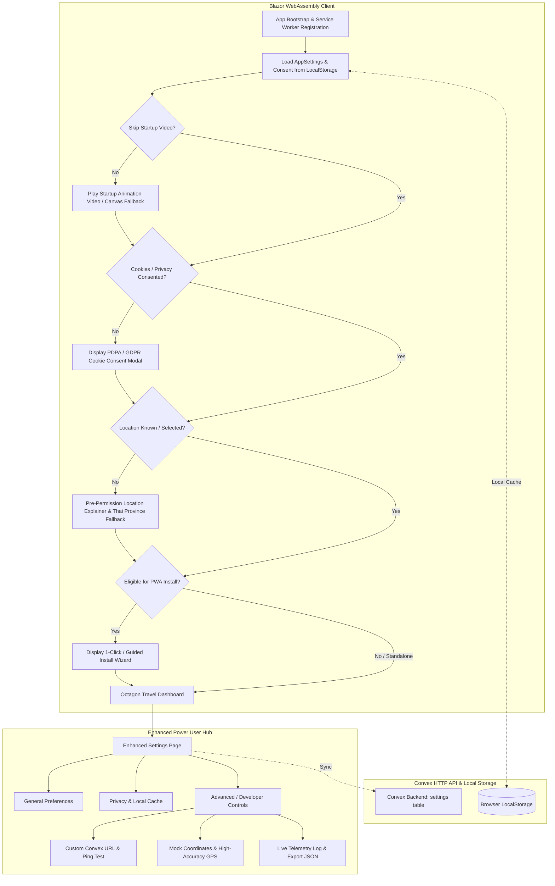

# Mathilda: PWA Install Wizard, Themed Startup Experience, Privacy Onboarding & Advanced Settings

This technical design document outlines the end-to-end implementation plan for upgrading **Mathilda** (C# Blazor WebAssembly Thailand Travel Utility) with PWA installability, a branded startup video/animation, best-practice privacy & location onboarding, a modernized travel UI, and an enhanced power-user settings hub.

---

## 1. Goal Description

Mathilda is currently a functional Blazor WebAssembly (.NET 8) client with basic pages and Convex backend integration. This project introduces five major capabilities:
1. **Easy Install for Non-Technical Users (Desktop & Mobile):** Adaptive PWA installation engine with a 1-click prompt on Chromium (Desktop/Android) and a visual step-by-step "Add to Home Screen" tutorial on iOS Safari.
2. **Themed Startup Animation Video:** An immersive, lightweight startup video and animated SVG canvas fallback capturing Thailand travel aesthetics (golden temples, tropical sunrise, Mathilda typography) with skip controls and persistent user bypass options.
3. **Privacy-First Consent & Location Onboarding:** GDPR & Thai PDPA compliant cookie/storage consent banner and a pre-permission location explainer modal with an instant manual Thai Province Selector fallback (Bangkok, Chiang Mai, Phuket, etc.) if GPS is denied or unavailable.
4. **Modernized Travel UI:** A cohesive Thailand-inspired visual design system (Ocean Cyan, Golden Amber, Glassmorphism, fluid typography) with responsive desktop & mobile navigation.
5. **Enhanced Settings for Advanced Users:** A power-user diagnostics tab with custom Convex deployment URL overrides, GPS high-accuracy toggles, simulated coordinate injection, service worker cache management, and rolling diagnostic telemetry logs.

---

## 2. Architecture & System Flow



---

## 3. User Review Required

> [!IMPORTANT]
> **iOS Safari PWA Installation Handling:**
> iOS Safari does not support the W3C `beforeinstallprompt` event. Mathilda will detect iOS user agents and present a custom visual instructional card with Safari icons (`Share` ➔ `Add to Home Screen` ➔ `Add`).

> [!TIP]
> **Video Autoplay & Bandwidth Optimization:**
> Modern mobile browsers enforce strict autoplay policies. The startup video will include `autoplay`, `muted`, `playsinline`, and a parallel CSS/SVG canvas animation that ensures zero-delay startup if media loading is slow on cellular networks.

> [!NOTE]
> **Non-Intrusive Geolocation (No Blind Permission Prompts):**
> Location requests will never trigger raw browser prompts on page load without context. Mathilda presents an educational pre-prompt explaining benefits (nearby food, weather, temples) with an immediate manual Thai Province fallback dropdown if permission is denied.

---

## 4. Proposed Changes

### Component 1: PWA Infrastructure & Install Wizard Engine

#### [NEW] `src/Mathilda/wwwroot/manifest.json`
Web App Manifest defining app metadata, theme colors, standalone display mode, categories, and icon definitions (192x192, 512x512, SVG maskable).

#### [NEW] `src/Mathilda/wwwroot/service-worker.js` & `src/Mathilda/wwwroot/service-worker.published.js`
Service worker implementing cache-first strategy for static assets (`_framework`, CSS, JS, media) and dynamic network fallback for Convex API calls.

#### [MODIFY] `src/Mathilda/wwwroot/index.html`
Add `<link rel="manifest" href="manifest.json">`, apple touch icons, theme-color meta tag, and service worker registration script.

#### [MODIFY] `src/Mathilda/wwwroot/js/interop.js`
Extend `window.mathilda` with:
- `pwa.listenForInstallPrompt()`: Captures and holds `beforeinstallprompt`.
- `pwa.canInstall()`: Returns boolean if prompt is deferred.
- `pwa.promptInstall()`: Invokes native install prompt.
- `pwa.isStandalone()`: Detects `display-mode: standalone` and `navigator.standalone`.
- `pwa.getPlatformInfo()`: Returns platform type (`iOS`, `Android`, `DesktopChromium`, `Other`).
- `storage.getItem(key)` / `storage.setItem(key, val)`: Safe LocalStorage wrappers.

#### [NEW] `src/Mathilda/Models/PlatformInfo.cs`
C# record capturing platform name, standalone status, and install prompt availability.

#### [NEW] `src/Mathilda/Services/InstallPromptService.cs`
Scoped service managing PWA installation lifecycle, reactive event subscriptions, and prompt dismissal tracking.

#### [NEW] `src/Mathilda/Components/InstallWizardModal.razor`
Adaptive install dialog offering:
- 1-click Install button for Desktop Chromium & Android.
- 3-step visual tutorial for iOS Safari.
- "Don't show again" toggle.

---

### Component 2: Themed Startup Animation Video & Splash

#### [NEW] `src/Mathilda/wwwroot/media/mathilda-startup.mp4` & `src/Mathilda/wwwroot/media/startup-fallback.svg`
Optimized startup media assets featuring Thailand temple silhouettes, tropical sunrise palette, and Mathilda branding.

#### [NEW] `src/Mathilda/Components/StartupVideoIntro.razor`
Video player with HTML5 `<video>`, SVG canvas fallback, "Skip Intro [✕]" button, loading progress indicator, and transition callback.

#### [MODIFY] `src/Mathilda/Pages/SplashPage.razor`
Update to coordinate video playback with background service warmup (Convex check, settings loading) before navigating to `/`.

---

### Component 3: Privacy & Location Consent Onboarding

#### [NEW] `src/Mathilda/Models/PrivacyConsent.cs`
Record holding user consent choices:
```csharp
public sealed record PrivacyConsent(
    bool EssentialAccepted,
    bool PreferencesAccepted,
    bool AnalyticsAccepted,
    DateTimeOffset ConsentTimestamp
);
```

#### [NEW] `src/Mathilda/Models/ThaiProvinces.cs`
Pre-populated coordinates for major travel hubs:
- Bangkok (`13.7563, 100.5018`)
- Chiang Mai (`18.7883, 98.9853`)
- Phuket (`7.8804, 98.3923`)
- Pattaya (`12.9276, 100.8771`)
- Koh Samui (`9.5120, 100.0136`)
- Krabi (`8.0863, 98.9063`)
- Hua Hin (`12.5684, 99.9577`)
- Ayutthaya (`14.3532, 100.5684`)

#### [NEW] `src/Mathilda/Services/PrivacyConsentService.cs`
Service managing privacy consent state, persistence to `localStorage`, and event dispatching.

#### [NEW] `src/Mathilda/Components/PrivacyConsentModal.razor`
GDPR / PDPA compliant dialog offering "Accept All", "Essential Only", and "Customize" options.

#### [NEW] `src/Mathilda/Components/LocationPromptModal.razor`
Pre-permission explainer modal with "Enable GPS Location" button and immediate "Select Thai City / Province" fallback dropdown.

---

### Component 4: Modernized Travel UI & Dashboard

#### [MODIFY] `src/Mathilda/wwwroot/css/app.css`
Implement comprehensive design system tokens:
- Primary: Deep Thai Blue `#0369a1` & Ocean Cyan `#0284c7`
- Accent: Royal Gold `#d97706` & Sunset Amber `#f59e0b`
- Surface: Glassmorphism translucent layers `#ffffff15` with `backdrop-filter: blur(12px)`
- Dark mode theme tokens and accessible focus states.

#### [MODIFY] `src/Mathilda/Pages/OctagonDashboard.razor`
Overhaul dashboard to include:
- Status Header Bar: [🟢 Offline Ready] [📍 Active Location: Bangkok] [📲 Install App] [⚙️ Settings]
- Modern animated octagon tiles with SVG iconography for all 8 utilities.
- Quick currency converter chip and quick weather widget summary.

---

### Component 5: Enhanced Settings for Advanced Users

#### [NEW] `src/Mathilda/Models/AppSettings.cs`
Comprehensive settings record:
```csharp
public sealed record AppSettings(
    string Language = "en",
    string Theme = "system",
    string Currency = "THB",
    string UnitSystem = "metric",
    bool SkipStartupVideo = false,
    bool ShowInstallPrompt = true,
    string? CustomConvexUrl = null,
    bool HighAccuracyGps = false,
    int GpsTimeoutSeconds = 10,
    bool MockLocationEnabled = false,
    string? MockCoordinates = null,
    bool EnableDebugTelemetry = false
);
```

#### [NEW] `src/Mathilda/Services/AppSettingsService.cs`
Service managing configuration state, reactive updates, `localStorage` persistence, and optional background sync to Convex `settings` table.

#### [MODIFY] `convex/schema.ts` & `convex/settings.ts`
Extend Convex schema and mutations to store advanced fields while maintaining full backward compatibility.

#### [NEW] `src/Mathilda/Components/AdvancedSettingsPanel.razor`
Power-user settings component containing:
- Convex Custom URL input, Ping latency test button, and connection status indicator.
- GPS hardware tuning (High Accuracy toggle, Timeout slider).
- Simulated location injector (Select province -> override active GPS).
- PWA & Storage manager (Cache usage indicator, Clear Cache, Force Service Worker Update).
- Telemetry log viewer and "Export Debug JSON" button.

#### [MODIFY] `src/Mathilda/Pages/SettingsPage.razor`
Refactor into tabbed layout: `[ General ]`, `[ Privacy & Storage ]`, `[ ⚡ Power User ]`.

---

## 5. Verification & Testing Plan

### Automated Unit & Component Tests (`bUnit` + `xUnit`)

Execute via:
```bash
dotnet test
```

New test suites:
1. `tests/Mathilda/Services/InstallPromptServiceTests.cs`: Verifies initial state, deferred prompt detection, dismissal persistence.
2. `tests/Mathilda/Services/PrivacyConsentServiceTests.cs`: Verifies consent record serialization, default permissions, and update events.
3. `tests/Mathilda/Services/AppSettingsServiceTests.cs`: Verifies settings loading from JSON, fallback defaults, and state change triggers.
4. `tests/Mathilda/Components/InstallWizardModalTests.cs`: Verifies rendering of 1-click prompt on Android/Desktop vs visual tutorial on iOS.
5. `tests/Mathilda/Components/StartupVideoIntroTests.cs`: Verifies video rendering, skip button action, and callback completion.
6. `tests/Mathilda/Components/LocationPromptModalTests.cs`: Verifies GPS trigger and manual province fallback selection.
7. `tests/Mathilda/Pages/SettingsPageTests.cs`: Verifies tab switching, setting updates, and power-user coordinate injection.
8. `tests/Mathilda/Pages/OctagonDashboardTests.cs`: Verifies 8 octagon tiles, status bar elements, and install button.

### Production Build & Static Verification

Execute via:
```bash
dotnet publish src/Mathilda/Mathilda.csproj -c Release -o publish
```
Verify `publish/wwwroot`:
- `manifest.json` is present and valid JSON.
- `service-worker.js` is included.
- `_framework` WASM binaries compile without warnings.
- Output is static-host ready for Vercel.

### Manual Verification Flows
1. **PWA Install Wizard Flow:** Open Chrome on Desktop or Android ➔ observe install prompt / banner ➔ trigger install wizard ➔ click "1-Click Install" ➔ app installs to desktop/homescreen. Test on iOS Safari ➔ verify step-by-step visual tutorial is displayed.
2. **Startup Video Flow:** Launch app on fresh session ➔ watch startup animation ➔ click "Skip Intro" ➔ immediately transitions to Dashboard. Enable "Skip intro on startup" in Settings ➔ reload ➔ verify immediate load.
3. **Location & Privacy Onboarding Flow:** Click "My Location" on fresh session ➔ observe pre-permission explainer ➔ grant permission OR select "Bangkok" from fallback dropdown ➔ verify coordinates update across Weather and Attractions.
4. **Power User Settings Flow:** Open `/settings` ➔ switch to `⚡ Power User` tab ➔ test custom Convex URL ping ➔ select "Phuket" mock location ➔ verify mock coordinates take effect.
